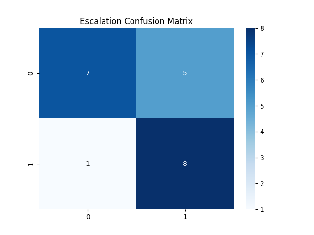

📞 CallSense — Customer Support Call Sentiment & Escalation Predictor.
📌 Overview

CallSense is an NLP pipeline that analyzes customer support call transcripts to:

Classify Sentiment → Positive / Neutral / Negative

Predict Escalation Risk → Probability a case will require supervisor, refund, or cancellation

Provide Insights → Top escalation triggers, high-risk customers, and agent performance metrics

It produces trained models, predictions, insights, and visualizations to improve Customer Experience (CX) and Agent Coaching.

⚙️ Tech Stack

Python: 3.11+

Libraries:

pandas, numpy → Data handling

scikit-learn, lightgbm → ML models

nltk → Lexicon sentiment features

matplotlib, seaborn → Visualizations

joblib, h5py, yaml → Artifacts

Models:

Sentiment Classifier → Logistic Regression + TF-IDF + Lexicon features

Escalation Predictor → LightGBM

📂 Project Structure
Customer Support Call Sentiment & Escalation Predictor/
│
├── archive/
│   ├── customer_call_transcriptions.csv   # Raw dataset (transcript + sentiment labels)
│   └── sample_customer_call.wav           # (Optional) audio sample
│
├── sentiment_model.pkl                    # Trained sentiment classifier
├── escalation_model.pkl                   # Trained escalation predictor
├── predictions.csv                        # Predictions for all calls
├── processed_calls.h5                     # Processed features & labels
├── insights.json                          # Agent & customer-level insights
├── build_metadata.yaml                    # Run metadata
│
├── visuals/                               # Plots
│   ├── accuracy_graph.png
│   ├── confusion_matrix_heatmap.png
│   ├── escalation_risk_heatmap.png
│   └── sentiment_trends.png
│
├── callsense_pipeline_tfidf_fixed.py      # Training pipeline
├── callsense_save_predictions.py          # Prediction + save results
└── README.md

🚀 Setup & Installation

Clone / Download the Project
Place your dataset CSV into archive/customer_call_transcriptions.csv.

Install Dependencies

pip install pandas numpy matplotlib seaborn scikit-learn lightgbm nltk h5py pyyaml joblib

Download NLTK Lexicon (first time only)

import nltk
nltk.download("vader_lexicon")

🏋️ Training Pipeline

Run the training pipeline:

python callsense_pipeline_tfidf_fixed.py

This will:

Train models for sentiment and escalation

Save artifacts (.pkl, .h5, .yaml)

Generate insights (insights.json)

Produce visualizations in visuals/

📊 Prediction & Results

Run the prediction script:

python callsense_save_predictions.py

This will:

Load trained models

Generate predictions for each transcript

Save them to predictions.csv

Save a summary to results_summary.json

Print the first 10 predictions in the console

Example output:

Sample predictions:
                                           transcript sentiment_pred  sentiment_conf  escalation_prob
0  how's it going Arthur I just placed an order ...       negative            0.82             0.77
1  yeah hello I'm just wondering if I can speak ...        neutral            0.68             0.34

📈 Visualizations

Accuracy Graph → visuals/accuracy_graph.png

Confusion Matrix → visuals/confusion_matrix_heatmap.png

Escalation Heatmap → visuals/escalation_risk_heatmap.png

Sentiment Trends → visuals/sentiment_trends.png

📊 Business Value

Reduce Churn: Identify frustrated customers early

Boost Agent Performance: Coaching insights from escalation triggers

Improve CX: Monitor sentiment trends over time

Smart Staffing: Predict escalation risk to allocate supervisors
AUTHOR
SAGNIK PATRA
